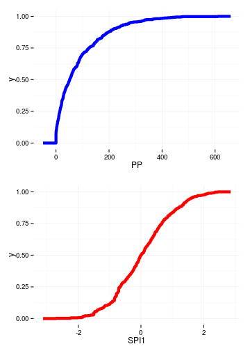
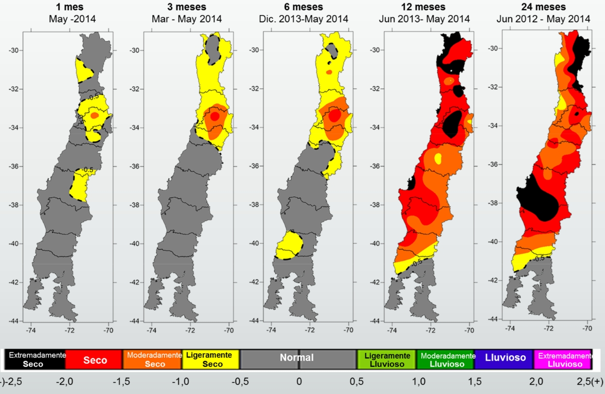
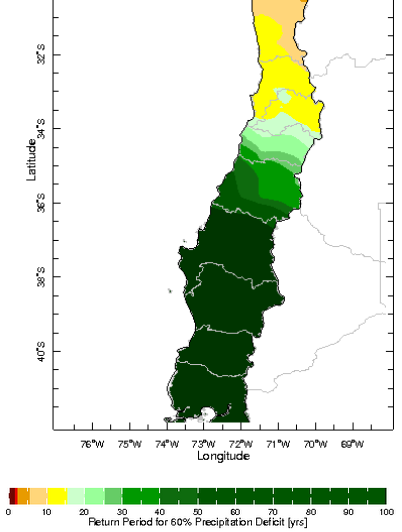
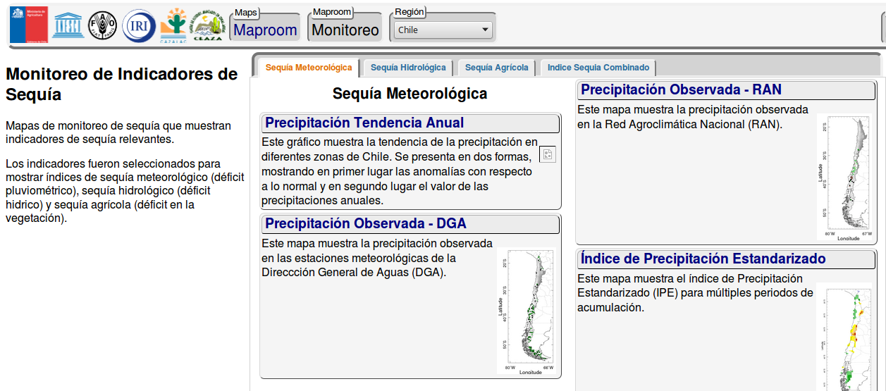
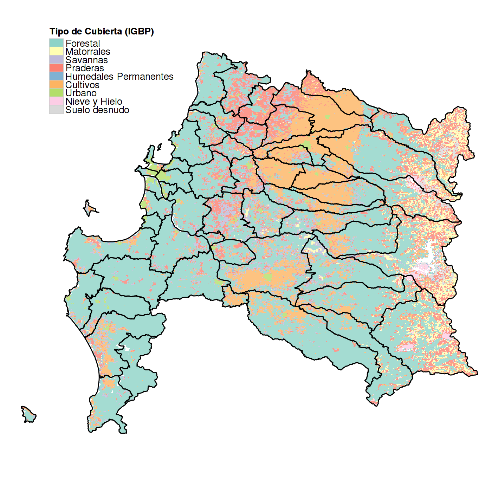

## Definición de Sequía

>- Es un fenómeno rastrero __(Gillette, 1950)__
>- La sequía es el desastre natural más complejo de identificar, analizar, monitorear y manejar **(Burton, Kates, & White, 1978, p. 240; Wilhite,1993)**.
>- Las diferentes variables hidrometeorológicas y factores socioeconómicos, así como la naturaleza estocástica de la demanda de agua, es un obstaculo para una definición precisa **(Mishra and Singh, 2010)**.
>- En una forma realista la definición de sequía debe ser para una región y aplicación (o impacto) específico __(Wilhite and Glantz, 1985)__.
>- _"The impracticality of a universal drought definition" **(Lloyd, 2014)**_

---

## Tipos de Sequía

<iframe src="diagram_type_drought.html" width=100% height=100% allowtransparency="true" style="background: #FFCCFF;"> </iframe>

---

## Investigaciones Relevantes

>1. Standarized Precipitation Index (SPI) (**Mckee, 1993**) *"The relationship of drought frecuency and duration to time scales"*
>2. Vegetation Condition Index (VCI) (**Kogan, 1990**) *"Remote sensing of weather impacts on vegetation in non-homogeneous areas"*
>3. Temperature Condition Index (TCI) (**Kogan, 1995**) *"Application of vegetation index and brightness temperature for drought detection"*
>4. Vegetation Health Index (VHI) (**Kogan, 1997**) *"Global drought watch from space"*
>5. Standarized Vegetation Index (SVI) (**Peters et al, 2002**) *"Drought Monitoring with NDVI-Based Standarized Vegetation Index"*
>6. Precipitation Condition Index (PCI) and Scaled Drought Condition Index (SDCI) (**Rhee et al, 2010**) *"Monitoring agricultural drought for arid and humid regions using multi-sensor remote sensing data"*
>7. Synthesized Drought Index (SDI) (**Du et al, 2013**) *"A comprehensive drought monitoring method integrating MODIS and TRMM data"*

---

## Investigaciones Relevantes

>8. Standarized Precipitation Evapotranspiration Index (SPEI) (**Vicente-Serrano et al, 2010**) *"A Multiscalar Drought Index Sensitive to Global Warming: The Standardized Precipitation Evapotranspiration Index"*

---

## Indicadores de Sequía

<iframe src="diagram_clases_drought.html" width=100% height=100% allowtransparency="true" style="background: #FFCCFF;"> </iframe>

---

## Tipos de Indicadores (Forma de Cálculo)

>- __ Estandarizados __
  - SPI
  - SPEI
  - SVI
  - Zratio
>- __ Escalados __
  - VCI
  - TCI
  - PCI
>- __ Combinados __
  - VHI
  - SDCI

---&twocol

## Índice Estandarizado de Precipitación (SPI)

*** =left

*** =right

## Características

>1. Sólo utiliza precipitación
>2. Permite utilizar diferentes escalas de tiempo
>3. Comparable espacialmente

---

## SPI Estación UdeC Chillán, 1, 3, 6 , 12 meses

<iframe src="dygraphs_spi.html" width=100% height=100% allowtransparency="true"> </iframe>

--- 

## Índice de Condición de la Vegetación (VCI)

$$
VCI = \frac{NDVI-NDVI_{min}}{NDVI_{max}-NDVI_{min}}
$$

### Caracteristica ###

<q> "Separa la componente climática de la vegetacional"</q>

---

## Índice de Condición de la Vegetación (VCI)

<iframe src="dygraphs_vci.html" width=100% height=80% allowtransparency="true"> </iframe>

---.segue bg:grey

## 2.- Declaración del Problema 

---&twocol

## ¿Que hay en Chile?

*** =left

- La Dirección Meteorológica de Chile (DMC) realiza el calculo del SPI

    

*** =right

- Atlas de Sequía ALC (CAZALAC) (**Nuñez et al.,2011**)
  - Periodo de Retorno
  - Máxima precipitación esperada
  - Mínima precipitación esperada

    

---

## ¿Que hay en Chile?

_ClimateDataLibrary (www.climatedatalibrary.cl/maproom)_

    

---{.build}

## ¿Qué hace falta?

>1. Evaluación conjunta entre los déficit de precipitaciones y la respuesta de la vegetación.
>2. Evaluación de la sequía agrícola a diferentes escalas temporales y espaciales.
>3. Una mejor compresión de la sequía desde el punto de vista de la componente agrícola.

## ¿Qué se propone?

>- __"Evaluar multiples indicadores de sequía meteorológia y agrícola a diferentes escalas temporales y espaciales en la zona agrícola centro sur de Chile"__

---.segue bg:grey

## 3.- Avances de la Investigación

---&twocol

## Fuentes de información utilizada

*** =left

**Satelital**

>- MODIS
  - MOD13 (Vegetación)
  - MOD11 (T° Superficial de Suelo)
  - MCD12 (Cubierta Terrestre) 

>- TRMM
  - 3B42 versión 7

*** =right

**Puntual**

>- Datos de precipitación
  - Dirección Meteorológica de Chile (DGA)
  - Dirección General de Aguas (DGA)
  - Otras fuentes

---

## Herramientas de análisis de datos

__Software Libre "R"__

>- Packages
  - raster (análisis de datos raster) (**Hijmans, 2015**)
  - maptools (mapas) (**Bivand and Lewin-Koh, 2015**)
  - plyr (manejo de gran cantidad de datos) (**Wickham, 2011**)
  - ggplot2 (gráfica) (**Wickham, 2011**)
  - SPEI (indicadores de sequía) (**Begueria and Vicente-Serrano,2013**)
  - Slidify (presentaciónes) (**Vaidyanathan, 2012**)
  - Knitr (investigación reproducible) (**Xie, 2014**)

---

## Indicadores de sequía seleccionados

>- SPI (precipitación, estandarizada)
>- VCI (vegetación, escalado)
>- TCI (T° superficial de suelo, escalada)
>- VHI (VCI+TCI, combinado)
>- SVI (vegetación, estandarizado)
>- PCI (precipitación TRMM, escalado)
>- SDCI (VCI+TCI+PCI, combinado)

---

## Área de estudio evaluada

__Región del Bío-Bío__

    

---.segue bg:grey

## 4.- Algunos resultados

---

## Índice VHI temporada agrícola (sept-abrl)

<iframe src="vhi_biobio.html" width=100% height=100% allowtransparency="true"> </iframe>

---

## Correlación entre SPI-3 (puntual) e indicadores satelitales

---.segue bg:grey

## Gracias

